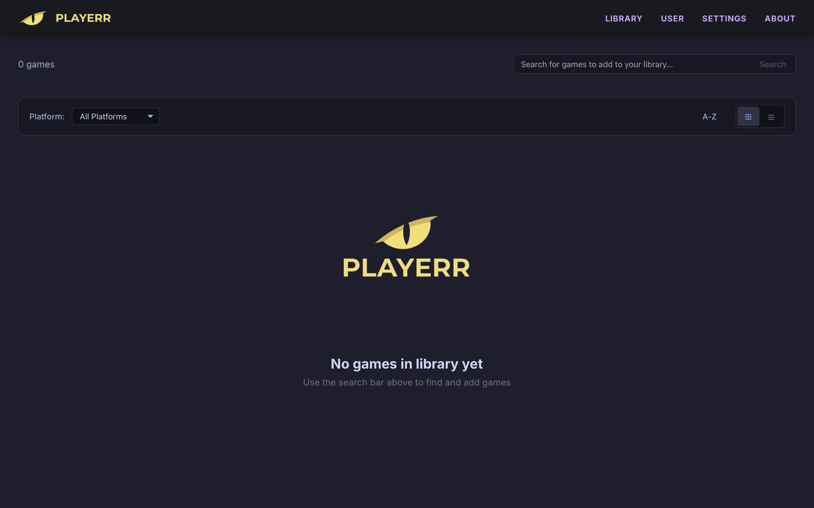
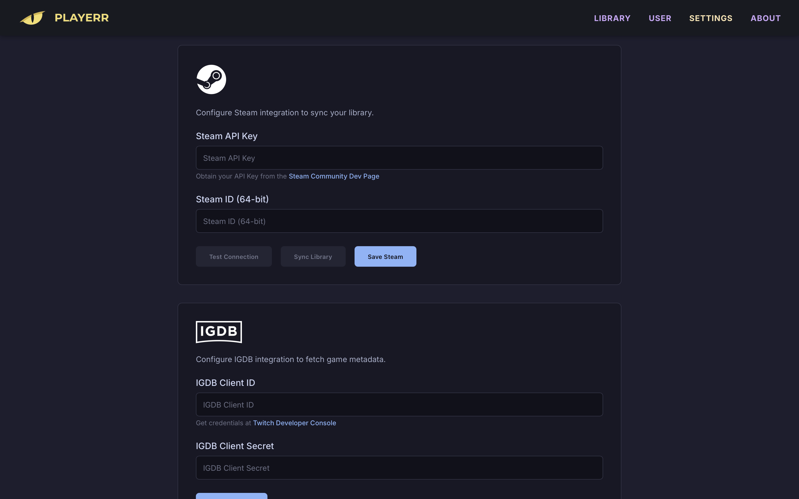
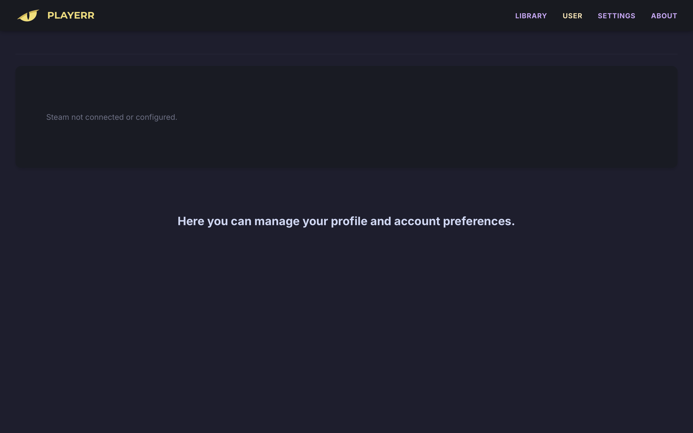

# Playerr v0.1.0-beta
### **Self-Hosted Game Library Manager & PVR**

[](https://playerr.app)
[](https://opensource.org/licenses/MIT)
[](https://hub.docker.com/r/maikboarder/playerr)

Inspired by the workflow of Radarr and Sonarr, Playerr is designed to be the definitive solution for video game enthusiasts who self-host their libraries. It bridges the gap between your local digital assets and the vast world of gaming metadata.

---

## Main Features

*   **Intelligent Library Scanning:** Recursive and smart recognition engine that identifies video game platforms across your storage, mapping local files to their respective titles.
*   **Rich Metadata Integration:** Native hooks into IGDB and Steam APIs to fetch high-quality artwork, descriptions, ratings, and release dates.
*   **Seamless PVR Workflow:** Support for Prowlarr and Jackett for automated indexer management and advanced searching.
*   **Integrated Download Management:** Native control for industry-standard clients like qBittorrent and Transmission.
*   **Modern Web GUI:** A vibrant, dark-themed responsive interface designed for both desktop and containerized environments.
*   **Unified Library View:** Display your entire gaming collection in one place, including native support for syncing and viewing your **Steam Library**.

## Screenshots

| Library | Game Details |
|:---:|:---:|
|  |  |

| Settings (Indexers) | Library Grid |
|:---:|:---:|
|  |  |

<p align="center">
  
  <br>
  <em>Steam Profile Integration</em>
</p>

## Supported Platforms

Playerr is architected for maximum reach, offering multi-platform binaries and containerized solutions:

*   **Docker:** Universal support for amd64 and arm64 (Raspberry Pi, CasaOS, Synology, etc.).
*   **Windows:** Native 64-bit performance.
*   **macOS:** Fully optimized for Apple Silicon (M1/M2/M3) and standard Intel builds.
*   **Linux:** Generic 64-bit binary distributions.

## Installation & Setup

### Docker (Recommended)
The easiest way to run Playerr is using Docker. It includes everything you need in a single container. Access the UI at `http://your-ip:2727`.

#### Standard Desktop / Server
Create a `docker-compose.yml` file and run `docker-compose up -d`:
```yaml
services:
  playerr:
    image: maikboarder/playerr:latest
    container_name: playerr
    ports:
      - "2727:2727"
    volumes:
      - ./config:/app/config
      - /your/games/path:/media
    restart: unless-stopped
```

#### CasaOS
1. Go to **App Store** -> **Custom Install**.
2. Click on **Import** (top right) and paste the Docker Compose code above.
3. Set your games path in the volumes section.
4. Click **Install**.

#### Synology / NAS
1. Open **Container Manager** (or Docker).
2. Go to **Project** -> **Create**.
3. Paste the Docker Compose code and configure your local folders.
4. Click **Done**.

### Build from Source (For Developers)

If you want to modify the code or build the image locally instead of pulling it from Docker Hub:

1. Clone the repository:
   ```bash
   git clone https://github.com/maikboarder/playerr.git
   cd playerr
   ```

2. Use the build command:
   ```bash
   docker build -t playerr:local .
   ```

3. Or use a `docker-compose.override.yml` to force a local build:
   ```yaml
   services:
     playerr:
       build: .
       image: playerr:local
       # ... rest of your config
   ```

---

## Roadmap

- [x] **v0.1.0 Beta:** Core PVR functionality and library scanning.
- [ ] **Bazzite Support:** Researching compatibility with Lutris and Proton.
- [ ] **DBI Protocol Integration:** Advanced USB file transfer and management for Portable Consoles environments.
- [ ] **CasaOS Official App:** Direct integration into the CasaOS App Store.
- [ ] **Legacy Support:** Extended optimization for Intel-based macOS systems.
- [ ] **Extensibility:** Support for community-driven scripts and metadata plugins.

## Community & Support

I'm building Playerr with the community in mind. Your feedback is the engine that drives our development.

*   **Contribute:** Found a bug? Have a killer feature idea? Open an issue or a PR!
*   **Support:** If Playerr brings value to your setup, consider supporting the project. Your contributions enable more focused development, better stability, and faster implementation of the roadmap.

[](https://ko-fi.com/maikboarder)
[](https://github.com/sponsors/Maikboarder)

## License

Distributed under the MIT License. See `LICENSE` for more information.

## Legal Disclaimer

Playerr is an open-source project for educational and personal library management. It is **not affiliated** with any third-party game platforms or metadata providers. The developers do not condone piracy; users are responsible for complying with their local laws regarding copyright and content usage. See `DISCLAIMER.md` for the full legal notice.

---
*Developed by Maikboarder*
